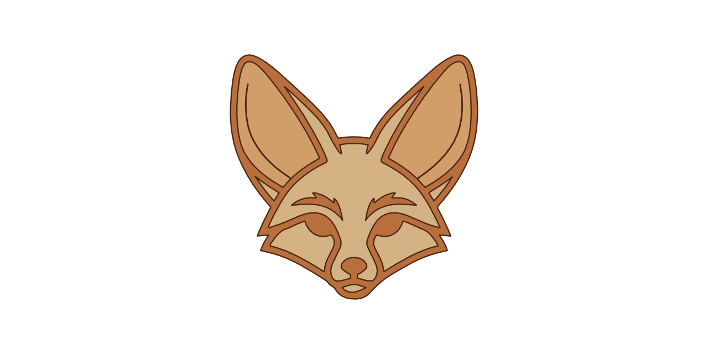

# Fenn: Friendly Environment for Neural Networks

   

**Stop writing boilerplate. Start training.**

Friendly Environment for Neural Networks (fenn) is a simple framework that automates ML/DL workflows by providing prebuilt trainers, templates, logging, configuration management, and much more. With fenn, you can focus on your model and data while it takes care of the rest.

## Support fenn

If fenn is useful for your work or research, consider supporting its development.

You can support the project by **starring the repository** on GitHub. It improves visibility and helps others discover fenn.

Sponsorship also helps fund maintenance, improvements, and new features.

Support the project:
https://github.com/sponsors/blkdmr

## Contributing

Contributions are welcome! 

Interested in contributing? Join the community on [Discord](https://discord.gg/WxDkvktBAa).

We can then discuss a possible contribution together, answer any questions, and help you get started!

**Please consult our CONTRIBUTING.md and CODE_OF_CONDUCT.md before opening a pull request.**

## Maintainers

The development and long-term direction of **fenn** is guided by the following maintainers:

| Maintainer | Role |
|------------|------|
| [@blkdmr](https://github.com/blkdmr) | Creator & Project Administrator |
| [@giuliaOddi](https://github.com/giuliaOddi) | Project Administrator |
| [@GlowCheese](https://github.com/GlowCheese) | Core Maintainer |
| [@franciscolima05](https://github.com/franciscolima05) | Core Maintainer |

Maintainers oversee the project roadmap, review pull requests, coordinate releases, and ensure the long-term stability and quality of the framework.

Thank you for supporting the project.